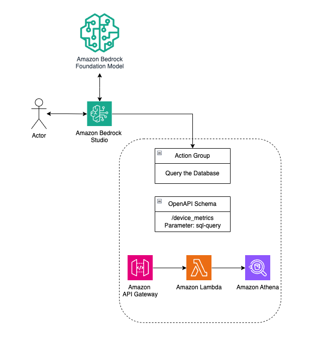

# Athena Query API for GenAI with Amazon Bedrock Studio

This project sets up an AWS API Gateway with a Lambda function that allows you to execute SQL queries on Amazon Athena and retrieve the results. You can use the API Gateway to interact with Amazon Bedrock Studio and build your text-to-SQL agent using generative AI capabilities.

## Description

The Athena Query API provides a convenient way to execute SQL queries on data stored in Amazon S3 using Amazon Athena. By leveraging the power of Athena, you can perform ad-hoc queries, generate reports, and analyze large datasets efficiently. This project simplifies the process of querying Athena by providing a serverless API that can be easily integrated into your applications.
## Architecture


The CloudFormation template provisions the following resources:
- An AWS Lambda function to execute Athena queries
- An IAM role with the necessary permissions for the Lambda function to access Athena and S3
- An API Gateway REST API with a POST method that triggers the Lambda function
- An S3 bucket for storing Athena query results (parameter)
- An S3 bucket containing the data used by Athena (parameter)

## Requirements
- AWS CLI (version 2.x)
- AWS SDK (version 3.x)
- Python (version 3.8 or higher)
- An AWS account with sufficient permissions to create the necessary resources

## Prerequisites
- An S3 bucket for storing Athena query results
- An S3 bucket containing the data you want to query with Athena
- An Amazon Athena Database with a populated table

## Deployment
1. Clone the repository:
   ```
   git clone https://github.com/your-repo/athena-query-api.git
   cd athena-query-api
   ```
2. Run the following AWS CLI command to create the CloudFormation stack:
   ```
   aws cloudformation create-stack --stack-name athena-query-api --template-body file://cloudformation.yaml --parameters ParameterKey=S3OutputBucket,ParameterValue=<output-bucket-name> ParameterKey=S3DataBucket,ParameterValue=<data-bucket-name> --capabilities CAPABILITY_NAMED_IAM
   ```
   Replace `<output-bucket-name>` and `<data-bucket-name>` with the appropriate S3 bucket names.
3. Wait for the stack creation to complete. You can check the status using the following command:
   ```
   aws cloudformation describe-stacks --stack-name athena-query-api --query 'Stacks[0].StackStatus'
   ```
4. Once the stack creation is complete, retrieve the API Gateway endpoint URL from the stack outputs:
   ```
   aws cloudformation describe-stacks --stack-name athena-query-api --query 'Stacks[0].Outputs[?OutputKey==`QueryAthenaApiUrl`].OutputValue' --output text
   ```
5. Now let's retrieve the API Key ID 
   ```
   aws cloudformation describe-stacks --stack-name athena-query-api --query 'Stacks[0].Outputs[?OutputKey==`QueryAthenaApiKey`].OutputValue' --output text
   ```
6. Using the retrived ID let's get the API key Value 
   ```
   aws apigateway get-api-key --api-key <QueryAthenaApiKeyValue> --include-value --query 'value' --output text
   ```

## Usage

1. Obtain the API Gateway endpoint URL from the AWS API Gateway console.
2. Send a POST request to the endpoint with the following JSON body:
   ```json
   {
     "query": "SELECT * FROM your_table LIMIT 10",
     "database": "DATABASENAME"
   }
   ```
   Replace `your_table` with the name of the table you want to query.
3. The API will execute the Athena query and return the results in the response body.

Here's an example using cURL:
```bash
curl --header "x-api-key:<your API Key Here>" https://<api-gateway-endpoint>.execute-api.us-east-1.amazonaws.com/Prod/query --data '{"query":"SELECT MAX(temperature) AS max_temp FROM iot_device_metrics WHERE device_id = 1009","database":"iot_ops_glue_db"}'
```

Make sure to replace `<api-gateway-endpoint>` with the actual API Gateway endpoint URL and `<your API Key Here>`  with the API key value obtained from step 6 in the deployment process.

## Integration with Amazon Bedrock Studio
Before proceeding with the integration steps, ensure that Amazon Bedrock Studio is set up in your AWS account. If you are an administrator, follow the AWS documentation to create and configure an Amazon Bedrock Studio workspace from the AWS console: [Create an Amazon Bedrock Studio workspace](https://docs.aws.amazon.com/bedrock/latest/userguide/administer-create-workspace.html).

Once Amazon Bedrock Studio is set up, follow these steps to integrate the Athena Query API:
1. Login to your Amazon Bedrock Studio account.
2. Create a new project by entering a project name and a description.
3. Access the newly created project and click on "Create new component".
4. Select "Create a new function" and add the function name.
5. Enter the schema provided in the `openapi.json` file. Make sure you modify the API Gateway endpoint and use the one created from the CloudFormation template.
6. Select "Authenticate using API Keys" and choose the following:
   - Key sent in Header
   - Key name: `x-api-key`
   - Key value: Add the value of the API key. You can get the value from the AWS console or ask your admin for the key.
7. Click "Create".
8. Now create the app by clicking on "Create app".
9. Select the LLM model that you would like to experiment with 
9. Add the following system prompt (feel free to modify as you see fit):
   ```
   Data Query Master is fine-tuned to not only generate SQL queries for Amazon Athena but also to execute via the provided API endpoint. It will send the SQL query to the endpoint (https://<api-gateway-endpoint>/query), including the method to construct the request with necessary parameters, headers, and the appropriate payload. You will always send the SQL query to the endpoint (https://<api-gateway-endpoint>/query). You will use iot_ops_glue_db as the name of the database instead of default. Here is the schema:

   CREATE EXTERNAL TABLE `iot_device_metrics`(
     `device_name` bigint, 
     `oil_level` double,
     `temperature` double,
     `pressure` double,
     `received_at` string,
     `device_id` bigint)
   ```
   Replace `<api-gateway-endpoint>` with the actual API Gateway endpoint URL.
10. Select "Functions" and add the function you created above.
11. Click "Save" and test the app.

## Troubleshooting

- If you encounter any issues during the deployment or usage of the Athena Query API, double-check the following:
  - Ensure that you have the necessary permissions to create and access the required AWS resources.
  - Verify that the S3 buckets specified in the CloudFormation parameters exist and are accessible.
  - Check the Lambda function logs in CloudWatch for any error messages or exceptions.
- If you receive an "Unauthorized" error when making API requests, make sure you have provided the correct API key in the request headers.

## Cleanup

To delete the CloudFormation stack and all provisioned resources, run:
```
aws cloudformation delete-stack --stack-name athena-query-api
```

## Contributing

Contributions are welcome! If you find any issues or have suggestions for improvement, please open an issue or submit a pull request.

## License

This project is licensed under the MIT License. See the [LICENSE](LICENSE) file for more information.